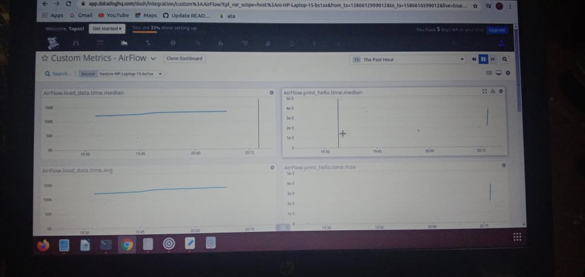

# AirflowDatadogsetup

**1.Install the Airflow StatsD plugin**

    pip install 'apache-airflow[statsd]
    
**2.Update the Airflow configuration file airflow.cfg by adding some properties**

    [scheduler]

    statsd_on = True 
    statsd_host = localhost 
    statsd_port = 8125 
    statsd_prefix = airflow 
    
**3.Update the Datadog Agent main configuration file datadog.yaml by adding someproparties into datadog.yaml.**

    Check Datadog.yaml file and the extra part and it looks like 
    
    dogstatsd_mapper_profiles:
     - name: airflow
       prefix: "airflow."
       mappings:
         - match: "airflow.*_start"
           name: "airflow.job.start"
           tags:
             job_name: "$1"
         - match: "airflow.*_end"
           name: "airflow.job.end"
           tags:
             job_name: "$1"
         - match: "airflow.operator_failures_*"
           name: "airflow.operator_failures"
           tags:
             operator_name: "$1"
         - match: "airflow.operator_successes_*"
           name: "airflow.operator_successes"
           tags:
             operator_name: "$1"
         - match: 'airflow\.dag_processing\.last_runtime\.(.*)'
           match_type: "regex"
           name: "airflow.dag_processing.last_runtime"
           tags:
             dag_file: "$1"
         - match: 'airflow\.dag_processing\.last_run\.seconds_ago\.(.*)'
           match_type: "regex"
           name: "airflow.dag_processing.last_run.seconds_ago"
           tags:
             dag_file: "$1"
         - match: 'airflow\.dag\.loading-duration\.(.*)'
           match_type: "regex"
           name: "airflow.dag.loading_duration"
           tags:
             dag_file: "$1"
         - match: "airflow.pool.open_slots.*"
           name: "airflow.pool.open_slots"
           tags:
             pool_name: "$1"
         - match: "airflow.pool.used_slots.*"
           name: "airflow.pool.used_slots"
           tags:
             pool_name: "$1"
         - match: "airflow.pool.starving_tasks.*"
           name: "airflow.pool.starving_tasks"
           tags:
             pool_name: "$1"
         - match: 'airflow\.dagrun\.dependency-check\.(.*)'
           match_type: "regex"
           name: "airflow.dagrun.dependency_check"
           tags:
             dag_id: "$1"
         - match: 'airflow\.dag\.(.*)\.([^.]*)\.duration'
           match_type: "regex"
           name: "airflow.dag.task.duration"
           tags:
             dag_id: "$1"
             task_id: "$2"
         - match: 'airflow\.dag_processing\.last_duration\.(.*)'
           match_type: "regex"
           name: "airflow.dag_processing.last_duration"
           tags:
             dag_file: "$1"
         - match: 'airflow\.dagrun\.duration\.success\.(.*)'
           match_type: "regex"
           name: "airflow.dagrun.duration.success"
           tags:
             dag_id: "$1"
         - match: 'airflow\.dagrun\.duration\.failed\.(.*)'
           match_type: "regex"
           name: "airflow.dagrun.duration.failed"
           tags:
             dag_id: "$1"
         - match: 'airflow\.dagrun\.schedule_delay\.(.*)'
           match_type: "regex"
           name: "airflow.dagrun.schedule_delay"
           tags:
             dag_id: "$1"
         - match: 'airflow\.task_removed_from_dag\.(.*)'
           match_type: "regex"
           name: "airflow.dag.task_removed"
           tags:
             dag_id: "$1"
         - match: 'airflow\.task_restored_to_dag\.(.*)'
           match_type: "regex"
           name: "airflow.dag.task_restored"
           tags:
             dag_id: "$1"
         - match: "airflow.task_instance_created-*"
           name: "airflow.task.instance_created"
           tags:
             task_class: "$1"

    
**4.Restart DataDog with Airflow**

    sudo service datadog-agent restart
    
**Configuration on Ubantu**

    The configuration files and folders for the Agent are located in: 
    
        /etc/datadog-agent/datadog.yaml  
        Configuration files for Integrations: 

        /etc/datadog-agent/conf.d/  
        ** if conf.yaml.example file is given then rename into conf.yaml  
        
# Resources

 **Airflow Integrate Datadog**
   
   https://docs.datadoghq.com/integrations/airflow/
        
# Output

  

`

